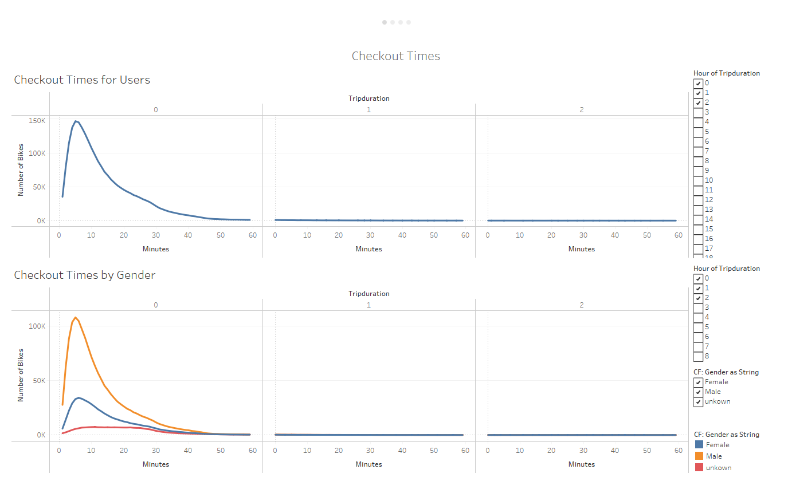
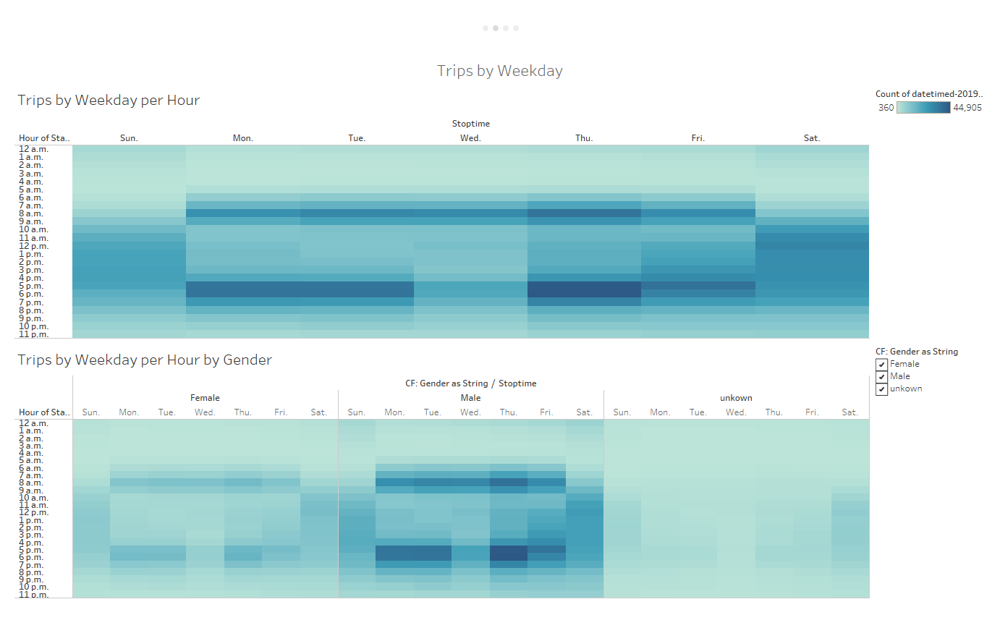
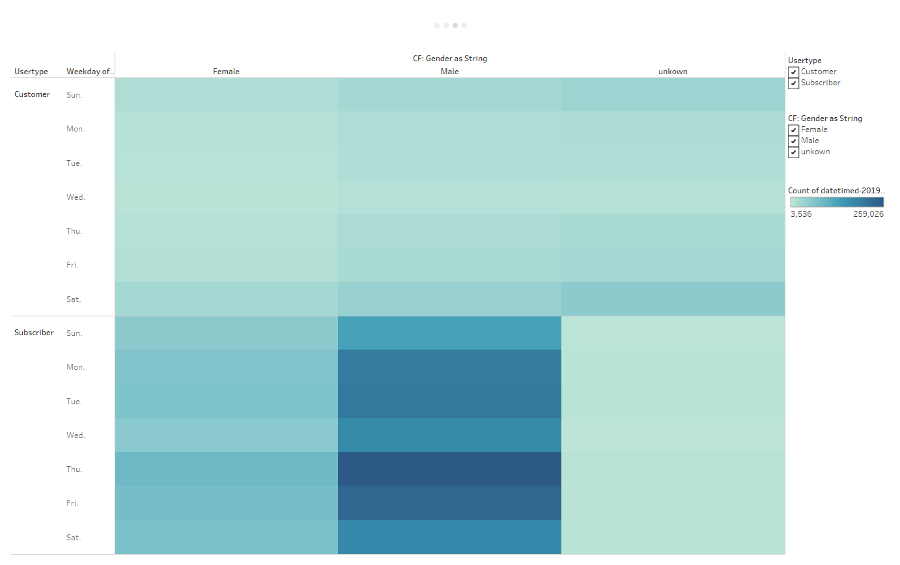
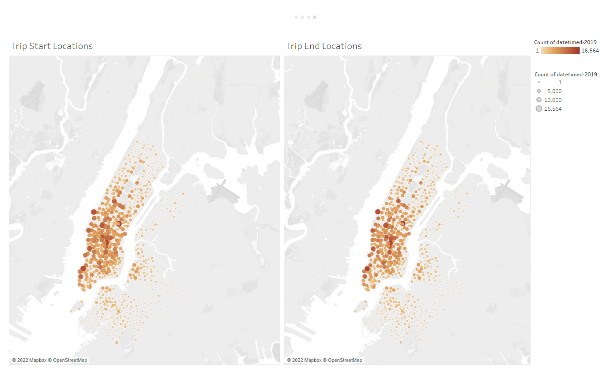

# Bikesharing
 
## Overview
The purpose of this project is to analyze and visualize data from CitiBike in New York City in order to help convince investors that a bike-sharing program in a new city is a solid business proposal. The data used in this project is from August 2019, and is visualized using Tableau.

## Results
### How long do customers use the bikes for?

Figure 1: Checkout Times for Users

Seen in figure 1, the majority of trips are less than 10 minutes and the vast majority of trips are less than 1 hour. When divided by gender, the results show that the majority of users are male, and usage time between genders is similar.

### What are the most popular times of the day for bike usage?

Figure 2: Trips by Weekday per Hour

Seen in figure 2, the bikes are most commonly used during commute times around 8am and 5-6pm on weekdays, and during the afternoon on weekends. Dividing this data by gender shows no large difference.

### When do subscribers vs. customers use the bikes?

Figure 3: Trips by Weekday per Gender and User Type

Seen in figure 3, subscribers use the bikes more frequently than customers, and the majority of subscribers use the bikes during the week. Customers use the bikes more frequently on weekends.

### Where are the bikes used the most?

Figure 4: Top Starting and Ending Locations

Seen in figure 4, the most popular starting and ending locations are almost identical, and are in the same area of Manhattan. The top 10 starting locations are all in Manhattan, and the top 10 ending locations are all in Manhattan or Brooklyn.

## Summary

Overall, bike-sharing usage in New York City is very high, and more importantly, seems to be very predictable. The most popular times of the day for bike usage are during commute times, and the most popular locations should also be predictable and unchanging. This makes it easy to predict where to place more bikes, and when to have more staff on hand. However, there are some limitations to this analysis. The data used is from August 2019, and it is possible that the usage patterns have changed since then. In order to get a more accurate picture of the usage patterns, it would be helpful to have data from multiple months, and possibly even multiple years. It would also be helpful to have data from other cities, so that the usage patterns can be compared to other cities. This would help to determine if the usage patterns are similar in other cities, or if they are unique to New York City. Additional visualizations that would be helpful to investors would be the usage of specific bikes and where they are located and if there are any bikes that are used more frequently than others. This would help to determine if there are any bikes that need to be replaced, or if there are any bikes that are not being used and could be removed from the fleet.